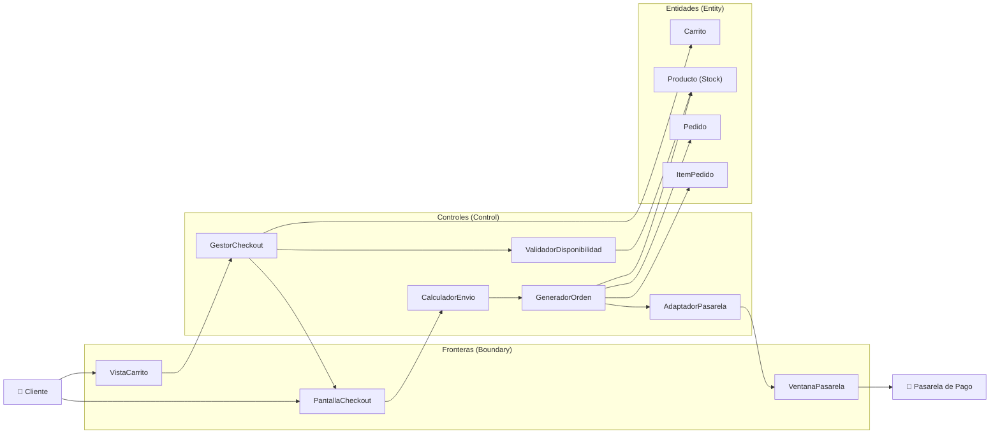
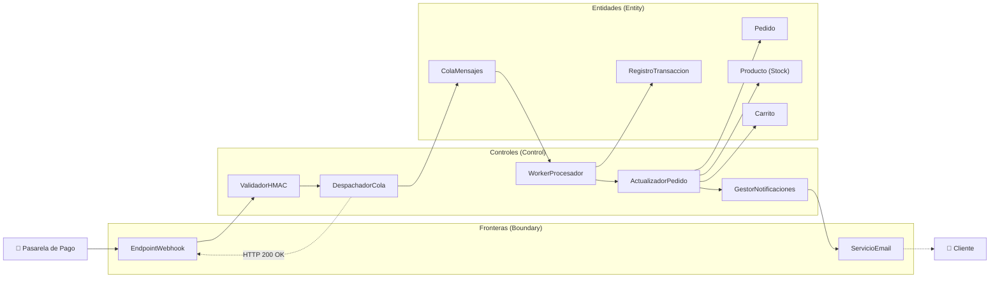

# Especificación de Requisitos y Arquitectura de Software (SRS)

**Proyecto:** Tienda Online de Artículos de Camping

**Enfoque Metodológico:** Roger S. Pressman (*Ingeniería del Software: Un enfoque práctico*) / Adaptación IEEE 830

**Arquitectura de Destino:** Serverless sobre Antigravity Runtime

**Motor de Persistencia:** Base de datos relacional ligera (LibSQL / SQLite en modo WAL)

---

## 1. Introducción y Alcance del Sistema

### 1.1 Objetivo General

Desarrollar una plataforma transaccional de comercio electrónico especializada en equipamiento de camping y vida al aire libre. La plataforma opera bajo un modelo desacoplado serverless de alta disponibilidad, garantizando procesamiento seguro de órdenes de compra, control atómico de stock físico y administración centralizada de catálogo, pedidos y usuarios.

### 1.2 Actores del Sistema

| Identificador | Actor | Naturaleza | Responsabilidad / Alcance |
| --- | --- | --- | --- |
| **ACT-01** | **Administrador** | Humano | Gestión comercial y operativa: ABM de productos, gestión de usuarios y despacho de órdenes de compra. |
| **ACT-02** | **Cliente** | Humano | Usuario registrado y autenticado: armado de carritos, checkout, consulta de historial y seguimiento. |
| **ACT-03** | **Visitante** | Humano | Usuario anónimo: exploración del catálogo público, filtros y registro inicial. |
| **ACT-04** | **Pasarela de Pago** | Sistema Externo | Proveedor externo que procesa transacciones monetarias y emite notificaciones asíncronas vía webhook. |

---

## 2. Requerimientos del Sistema

### 2.1 Requerimientos Funcionales (RF)

#### Módulo 1: Autenticación y Control de Acceso

* **RF-01 (Registro de Clientes):** El sistema debe permitir el autoregistro de visitantes capturando nombre, apellido, correo electrónico único y contraseña con requisitos de complejidad.
* **RF-02 (Autenticación y Sesión):** El sistema debe autenticar usuarios (Clientes y Administradores), generar tokens criptográficos de sesión (JWT) y aplicar control de acceso basado en roles (RBAC).
* **RF-03 (Recuperación de Credenciales):** El sistema debe permitir el restablecimiento de contraseñas mediante enlaces unívocos temporales despachados por correo electrónico.
* **RF-04 (ABM de Usuarios - Admin):** El sistema debe permitir al Administrador consultar, dar de alta, editar roles/datos y suspender cuentas de usuario.

#### Módulo 2: Catálogo e Inventario

* **RF-05 (Exploración y Filtrado):** El sistema debe presentar el catálogo público con filtrado por categoría (carpas, bolsas de dormir, mochilas, linternas), rango de precios, marcas y ordenamiento dinámico.
* **RF-06 (Ficha Técnica de Producto):** El sistema debe exponer imágenes, especificaciones técnicas, precio unitario y disponibilidad de stock en tiempo real por producto.
* **RF-07 (ABM de Productos - Admin):** El sistema debe permitir al Administrador registrar nuevos artículos, actualizar precios/descripciones y aplicar baja lógica (*soft delete*).
* **RF-08 (Control Atómico de Stock):** El sistema debe permitir ajustes manuales de stock por parte del Administrador y decrementar de manera automática y atómica las existencias físicas ante órdenes pagadas.

#### Módulo 3: Carrito de Compras

* **RF-09 (Operaciones del Carrito):** El sistema debe permitir al Cliente agregar artículos, modificar cantidades y eliminar elementos del carrito.
* **RF-10 (Validación de Existencias):** El sistema debe verificar en tiempo real que las cantidades solicitadas no excedan el stock disponible al agregar ítems y antes de iniciar el checkout.
* **RF-11 (Persistencia del Carrito):** El sistema debe almacenar el carrito asociado al ID del Cliente autenticado para mantener consistencia entre sesiones y dispositivos.

#### Módulo 4: Checkout, Pagos y Pedidos

* **RF-12 (Generación de Orden de Compra):** El sistema debe consolidar los ítems del carrito, calcular costo logístico, impuestos y total, generando un pedido en estado "Pendiente de pago".
* **RF-13 (Integración con Pasarela):** El sistema debe transferir la sesión de pago al proveedor externo con el identificador único del pedido y el importe exacto.
* **RF-14 (Procesamiento de Webhook):** El sistema debe recibir y validar las notificaciones de la pasarela, actualizando el pedido a "Pagado" o "Cancelado" de manera idempotente.
* **RF-15 (Historial de Compras):** El sistema debe permitir al Cliente consultar sus pedidos históricos, comprobantes y estados de entrega.
* **RF-16 (ABM de Pedidos - Admin):** El sistema debe permitir al Administrador auditar órdenes, filtrar por estado logístico y modificar estados de despacho con número de seguimiento.

---

### 2.2 Requerimientos de Seguridad Activa y Defensiva

#### Funcionales de Seguridad (RF-SEC)

* **RF-SEC-01 (Validación Estricta de Esquemas):** La capa de entrada de la API debe interceptar toda petición HTTP y contrastar parámetros de ruta, query strings y cuerpos JSON contra esquemas fuertemente tipados. Cualquier discrepancia o campo desconocido debe retornar `HTTP 400 Bad Request`.
* **RF-SEC-02 (Desacoplamiento de Procesamiento Pesado):** El sistema debe encolar en un bus asíncrono las tareas no críticas (emisión de correos, generación de comprobantes PDF y conciliación de webhooks) respondiendo de inmediato a la llamada HTTP.

#### No Funcionales de Seguridad (RNF-SEC)

* **RNF-SEC-01 (Cifrado de Credenciales):** Las contraseñas en reposo deben persistirse utilizando funciones de derivación de claves seguras con sal (Argon2id o bcrypt con costo $\ge$ 12).
* **RNF-SEC-02 (Cifrado en Tránsito):** Todas las comunicaciones deben forzar HTTPS bajo protocolo TLS 1.3 con soporte de HSTS.
* **RNF-SEC-03 (Cumplimiento PCI-DSS):** La base de datos del sistema no debe almacenar, procesar ni transmitir números de tarjetas de crédito o códigos CVV. La captura se delega enteramente a la pasarela externa.
* **RNF-SEC-04 (Control Estricto de Autorización):** Los endpoints bajo `/api/v1/admin/*` deben validar la firma del token JWT y el reclamo de rol `admin`, respondiendo `HTTP 403 Forbidden` ante accesos no autorizados.
* **RNF-SEC-05 (Mitigación de SQLi / Consultas Parametrizadas):** Queda prohibida la concatenación de texto para estructurar sentencias SQL. Toda operación contra el motor SQLite debe ejecutarse mediante consultas preparadas (*Prepared Statements*) fuertemente tipadas.
* **RNF-SEC-06 (Principio de Mínimo Privilegio en Persistencia):** El usuario de conexión a la base de datos debe carecer de privilegios DDL en tiempo de ejecución de la API, limitándose a sentencias DML (`SELECT`, `INSERT`, `UPDATE`, `DELETE`).
* **RNF-SEC-07 (Ofuscación de Errores del Motor):** El sistema debe atrapar excepciones a nivel global. Las respuestas de error internas deben limitarse a `HTTP 500 Internal Server Error` junto con un identificador de incidente (*Correlation ID*), evitando exponer metadatos del motor o del esquema.
* **RNF-SEC-08 (Rate Limiting en Borde):**
* Rutas públicas / catálogo: 60 peticiones/minuto por IP.
* Autenticación (Login/Registro): 5 intentos por cada ventana de 15 minutos por IP y cuenta (`HTTP 429 Too Many Requests`).
* Endpoints transaccionales: 30 peticiones/minuto por usuario autenticado.


* **RNF-SEC-09 (Límites de Carga Útil - Payload Limit):** El Gateway debe rechazar peticiones con `HTTP 413 Payload Too Large` si superan 2 MB en payloads estándar o 8 MB en subida de imágenes de catálogo.
* **RNF-SEC-10 (Timeouts y Circuit Breaker):** Las funciones síncronas deben cortar ejecución tras 3.000 ms (`HTTP 504 Gateway Timeout`). Las conexiones salientes hacia pasarelas deben implementar un *Circuit Breaker* si el 50% de las peticiones fallan en una ventana de 30 segundos.

---

### 2.3 Requerimientos No Funcionales (FURPS+)

#### Rendimiento (Performance)

* **RNF-PER-01 (Latencia del Catálogo):** El tiempo de respuesta para consultas de catálogo no debe superar 1.500 ms bajo una concurrencia sostenida de 150 usuarios.
* **RNF-PER-02 (Latencia Transaccional):** La creación de reservas de checkout no debe tardar más de 800 ms.

#### Confiabilidad (Reliability)

* **RNF-REL-01 (Disponibilidad):** La infraestructura serverless debe mantener una disponibilidad operativa mensual del 99.5%.
* **RNF-REL-02 (Atomicidad Transaccional):** Toda modificación que involucre pedidos, stock e inventario debe operar bajo transacciones ACID (`BEGIN IMMEDIATE`).

#### Usabilidad (Usability)

* **RNF-USA-01 (Diseño Responsivo):** La interfaz debe ajustarse fluidamente a partir de resoluciones de 360px de ancho y superar una puntuación de 85/100 en auditorías estándar de accesibilidad y rendimiento.
* **RNF-USA-02 (Eficiencia en Checkout):** El proceso de compra debe requerir como máximo 3 pasos de interacción entre la visualización del carrito y la derivación al pago.

#### Soportabilidad (Supportability)

* **RNF-SUP-01 (Trazabilidad y Logs):** Todos los eventos críticos y transaccionales deben emitirse en formato JSON estructurado hacia la consola estándar, incluyendo marca de tiempo UTC y nivel de severidad.
* **RNF-SUP-02 (Modularidad):** Separación estricta entre handlers de entrada, servicios de dominio y repositorios de persistencia, manteniendo una cobertura mínima de pruebas del 70%.

---

## 3. Modelo de Casos de Uso

### 3.1 Inventario de Casos de Uso y Matriz de Trazabilidad

| ID | Caso de Uso | Actores | RF Asociados | Dependencias UML |
| --- | --- | --- | --- | --- |
| **CU-01** | Registrar nueva cuenta | Visitante | RF-01, RF-SEC-01 | — |
| **CU-02** | Iniciar sesión / Autenticarse | Visitante, Cliente, Admin | RF-02, RF-SEC-01, RNF-SEC-08 | Extendido por flujos de compra |
| **CU-03** | Restablecer contraseña | Cliente, Admin | RF-03, RF-SEC-02 | — |
| **CU-04** | Cerrar sesión | Cliente, Admin | RF-02 | — |
| **CU-05** | Administrar usuarios (ABM) | Administrador | RF-04, RNF-SEC-04 | — |
| **CU-06** | Explorar y filtrar catálogo | Visitante, Cliente | RF-05, RNF-PER-01 | — |
| **CU-07** | Consultar detalle de producto | Visitante, Cliente | RF-06 | — |
| **CU-08** | Administrar productos (ABM) | Administrador | RF-07, RNF-SEC-04, RNF-SEC-09 | — |
| **CU-09** | Ajustar inventario físico | Administrador | RF-08, RNF-SEC-04 | — |
| **CU-10** | Agregar producto al carrito | Cliente | RF-09, RF-10, RF-11 | `<<include>>` CU-18 |
| **CU-11** | Modificar cantidades del carrito | Cliente | RF-09, RF-10 | `<<include>>` CU-18 |
| **CU-12** | Visualizar carrito | Cliente | RF-09, RF-11 | — |
| **CU-13** | Iniciar checkout y crear orden | Cliente | RF-10, RF-12, RNF-PER-02 | `<<include>>` CU-18, CU-19 |
| **CU-14** | Abonar orden en pasarela externa | Cliente, Pasarela | RF-13, RNF-SEC-03 | — |
| **CU-15** | Procesar Webhook de pago | Pasarela, Sistema | RF-14, RF-08, RF-SEC-02 | — |
| **CU-16** | Consultar compras históricas | Cliente | RF-15 | — |
| **CU-17** | Administrar y despachar pedidos | Administrador | RF-16, RNF-SEC-04 | — |
| **CU-18** | *Validar stock físico (Interno)* | Sistema | RF-10 | Invocado por CU-10, CU-11, CU-13 |
| **CU-19** | *Calcular costos y flete (Interno)* | Sistema | RF-12 | Invocado por CU-13 |

---

### 3.2 Especificación Formal de Casos de Uso Críticos

#### CU-13: Iniciar Checkout y Generar Orden de Compra

* **Actor Principal:** Cliente
* **Precondición:** El Cliente cuenta con sesión activa y al menos un producto en el carrito.
* **Disparador:** El Cliente pulsa "Proceder al Pago".
* **Flujo Principal:**
1. El sistema recupera los ítems vinculados al carrito del Cliente.
2. *[include CU-18: Validar stock]* El sistema verifica la disponibilidad para cada ítem.
3. El Cliente ingresa o confirma los datos de despacho.
4. *[include CU-19: Calcular costos y flete]* El sistema liquida subtotales, flete y total.
5. El sistema abre una transacción `BEGIN IMMEDIATE` en la base de datos:
* Incrementa `stock_reserved` en la tabla `products` para cada ítem.
* Inserta el registro en `orders` con estado `pending` y `expires_at = datetime('now', '+15 minutes')`.
* Inserta el desglose de productos en `order_items`.


6. El sistema genera el identificador de sesión contra la Pasarela de Pago y redirige al Cliente.


* **Flujos Alternativos:**
* **2a. Quiebre de existencias:** El sistema advierte los artículos sin stock, actualiza las cantidades en la vista del carrito y cancela el checkout.
* **5a. Conflicto de concurrencia en la reserva:** Si otro proceso reservó las existencias restantes, la transacción hace `ROLLBACK` y emite una alerta.


* **Postcondición:** Se crea la orden en estado `pending` y el stock queda reservado temporalmente por 15 minutos.

#### CU-15: Procesar Notificación de Pago (Webhook)

* **Actor Principal:** Pasarela de Pago (Sistema Externo)
* **Precondición:** Existe una orden registrada en estado `pending`.
* **Disparador:** Llamada `POST` entrante en `/api/v1/payments/webhook`.
* **Flujo Principal:**
1. El sistema intercepta el payload y recupera la cabecera con la firma criptográfica HMAC.
2. El sistema valida la firma en tiempo constante usando el secreto compartido.
3. El sistema almacena el evento en `webhook_events` de forma idempotente (`INSERT OR IGNORE`).
4. El sistema responde de inmediato con `HTTP 200 OK` al proveedor externo.
5. El sistema publica el evento en la cola interna de Antigravity.
6. El worker asíncrono toma el evento:
* Si el pago es `approved`: Transiciona la orden a `paid`, reduce `stock_available` y `stock_reserved`, vacía el carrito y despacha el correo de confirmación.
* Si el pago es `rejected`: Transiciona la orden a `cancelled` y libera `stock_reserved`.


* **Flujos Alternativos:**
* **2a. Firma HMAC inválida:** El sistema responde `HTTP 401 Unauthorized`, bloquea el procesamiento y genera log de seguridad.
* **3a. Evento duplicado:** Si el identificador ya existía en la base de datos, el sistema retorna `HTTP 200 OK` sin encolar nuevamente.


* **Postcondición:** El pedido asume un estado definitivo y el stock queda consolidado con atomicidad.

---

### 3.3 Ciclo de Vida y Transiciones de Estado del Pedido

```
                     ┌──────────────────┐
                     │  pending         │
                     │  (Reserva 15 min)│
                     └────────┬─────────┘
                              │
            ┌─────────────────┴─────────────────┐
            │ Webhook:                          │ Webhook: Rejected
            │ APPROVED                          │ o Cron Expirado
            ▼                                   ▼
   ┌──────────────────┐                ┌──────────────────┐
   │  paid            │                │  cancelled       │
   │  (Deducción Def.)│                │  (Stock Liberado)│
   └────────┬─────────┘                └──────────────────┘
            │ Admin:
            ▼
   ┌──────────────────┐
   │  preparing       │
   └────────┬─────────┘
            │ Admin:
            ▼
   ┌──────────────────┐
   │  shipped         │
   └────────┬─────────┘
            │ Entrega:
            ▼
   ┌──────────────────┐
   │  delivered       │
   └──────────────────┘

```

---

## 4. Análisis de Robustez (Boundary, Control, Entity)

### 4.1 Checkout y Reserva de Stock



### 4.2 Webhook Asíncrono e Idempotente



---

## 5. Arquitectura Técnica Serverless y Persistencia Ligera

### 5.1 Esquema Relacional de Base de Datos (LibSQL / SQLite DDL)

```sql
PRAGMA foreign_keys = ON;
PRAGMA journal_mode = WAL;
PRAGMA synchronous = NORMAL;
PRAGMA busy_timeout = 5000;

-- 1. Usuarios
CREATE TABLE users (
    id TEXT PRIMARY KEY,
    email TEXT NOT NULL UNIQUE COLLATE NOCASE,
    password_hash TEXT NOT NULL,
    first_name TEXT NOT NULL,
    last_name TEXT NOT NULL,
    role TEXT NOT NULL CHECK(role IN ('admin', 'client')) DEFAULT 'client',
    is_active INTEGER NOT NULL DEFAULT 1,
    created_at TEXT NOT NULL DEFAULT (datetime('now', 'utc')),
    updated_at TEXT NOT NULL DEFAULT (datetime('now', 'utc'))
);

CREATE INDEX idx_users_email ON users(email);

-- 2. Categorías
CREATE TABLE categories (
    id TEXT PRIMARY KEY,
    name TEXT NOT NULL UNIQUE,
    slug TEXT NOT NULL UNIQUE,
    description TEXT
);

-- 3. Productos
CREATE TABLE products (
    id TEXT PRIMARY KEY,
    category_id TEXT NOT NULL,
    name TEXT NOT NULL,
    slug TEXT NOT NULL UNIQUE,
    description TEXT NOT NULL,
    price_cents INTEGER NOT NULL CHECK(price_cents >= 0),
    stock_available INTEGER NOT NULL CHECK(stock_available >= 0),
    stock_reserved INTEGER NOT NULL DEFAULT 0 CHECK(stock_reserved >= 0),
    images_json TEXT NOT NULL DEFAULT '[]',
    is_active INTEGER NOT NULL DEFAULT 1,
    created_at TEXT NOT NULL DEFAULT (datetime('now', 'utc')),
    updated_at TEXT NOT NULL DEFAULT (datetime('now', 'utc')),
    FOREIGN KEY (category_id) REFERENCES categories(id) ON DELETE RESTRICT
);

CREATE INDEX idx_products_category ON products(category_id);
CREATE INDEX idx_products_active_stock ON products(is_active, stock_available);

-- 4. Carritos y Detalle
CREATE TABLE carts (
    id TEXT PRIMARY KEY,
    user_id TEXT NOT NULL UNIQUE,
    updated_at TEXT NOT NULL DEFAULT (datetime('now', 'utc')),
    FOREIGN KEY (user_id) REFERENCES users(id) ON DELETE CASCADE
);

CREATE TABLE cart_items (
    id TEXT PRIMARY KEY,
    cart_id TEXT NOT NULL,
    product_id TEXT NOT NULL,
    quantity INTEGER NOT NULL CHECK(quantity > 0),
    created_at TEXT NOT NULL DEFAULT (datetime('now', 'utc')),
    FOREIGN KEY (cart_id) REFERENCES carts(id) ON DELETE CASCADE,
    FOREIGN KEY (product_id) REFERENCES products(id) ON DELETE RESTRICT,
    UNIQUE(cart_id, product_id)
);

-- 5. Pedidos
CREATE TABLE orders (
    id TEXT PRIMARY KEY,
    user_id TEXT NOT NULL,
    status TEXT NOT NULL CHECK(status IN ('pending', 'paid', 'preparing', 'shipped', 'delivered', 'cancelled')) DEFAULT 'pending',
    subtotal_cents INTEGER NOT NULL CHECK(subtotal_cents >= 0),
    shipping_cents INTEGER NOT NULL CHECK(shipping_cents >= 0),
    total_cents INTEGER NOT NULL CHECK(total_cents >= 0),
    shipping_address_json TEXT NOT NULL,
    external_payment_id TEXT UNIQUE,
    created_at TEXT NOT NULL DEFAULT (datetime('now', 'utc')),
    updated_at TEXT NOT NULL DEFAULT (datetime('now', 'utc')),
    expires_at TEXT NOT NULL,
    FOREIGN KEY (user_id) REFERENCES users(id) ON DELETE RESTRICT
);

CREATE INDEX idx_orders_user ON orders(user_id);
CREATE INDEX idx_orders_status ON orders(status);
CREATE INDEX idx_orders_expires_at ON orders(expires_at) WHERE status = 'pending';

-- 6. Ítems del Pedido
CREATE TABLE order_items (
    id TEXT PRIMARY KEY,
    order_id TEXT NOT NULL,
    product_id TEXT NOT NULL,
    unit_price_cents INTEGER NOT NULL CHECK(unit_price_cents >= 0),
    quantity INTEGER NOT NULL CHECK(quantity > 0),
    FOREIGN KEY (order_id) REFERENCES orders(id) ON DELETE CASCADE,
    FOREIGN KEY (product_id) REFERENCES products(id) ON DELETE RESTRICT
);

-- 7. Registro de Webhooks (Auditoría e Idempotencia)
CREATE TABLE webhook_events (
    id TEXT PRIMARY KEY,
    source TEXT NOT NULL,
    event_type TEXT NOT NULL,
    payload_json TEXT NOT NULL,
    processed INTEGER NOT NULL DEFAULT 0 CHECK(processed IN (0, 1)),
    created_at TEXT NOT NULL DEFAULT (datetime('now', 'utc'))
);

CREATE INDEX idx_webhook_processed ON webhook_events(processed);

```

---

### 5.2 Catálogo de Funciones Serverless

| Ruta / Evento | Verbo | Handler | Permisos | Descripción Técnica |
| --- | --- | --- | --- | --- |
| `/api/v1/auth/register` | POST | `fn-auth-register` | Público | Valida esquema, genera hash con Argon2id, inserta usuario. |
| `/api/v1/auth/login` | POST | `fn-auth-login` | Público | Compara credenciales y emite token JWT firmado. Rate limit 5/15min. |
| `/api/v1/products` | GET | `fn-catalog-list` | Público | Consulta paginada con cláusulas de orden y filtros parametrizados. |
| `/api/v1/products/:id` | GET | `fn-catalog-detail` | Público | Retorna datos técnicos y calcula stock libre (`available - reserved`). |
| `/api/v1/cart` | GET/POST | `fn-cart-sync` | Cliente | Sincroniza estado del carrito; comprueba límites de inventario. |
| `/api/v1/cart/items/:id` | PATCH/DEL | `fn-cart-mutate` | Cliente | Altera cantidades o remueve ítems dentro de una transacción. |
| `/api/v1/checkout/session` | POST | `fn-checkout-session` | Cliente | Abre `BEGIN IMMEDIATE`, reserva existencias y genera la orden en `pending`. |
| `/api/v1/payments/webhook` | POST | `fn-payment-webhook` | Pasarela | Valida HMAC en tiempo constante, guarda evento y responde HTTP 200. |
| `/api/v1/admin/products` | CRUD | `fn-admin-products` | Admin | Gestión de productos con validación estricta de payloads (hasta 8 MB). |
| `/api/v1/admin/orders` | GET/PATCH | `fn-admin-orders` | Admin | Auditoría global de pedidos y transición de estados logísticos. |
| `queue:payment-events` | EVENT | `fn-worker-processor` | Sistema | Procesa aprobaciones o rechazos, altera stock y envía correos. |
| `cron:every-5-min` | TIME | `fn-cron-cleaner` | Sistema | Reclama reservas de órdenes vencidas en estado `pending`. |

---

### 5.3 Implementación de Idempotencia y Workers

#### Handler del Webhook (`fn-payment-webhook`)

```typescript
import { verifyHmacTimingSafe } from "./crypto";
import { db } from "./db";
import { queue } from "./queue";

export async function handler(req: Request): Promise<Response> {
  const signature = req.headers.get("x-signature-hmac") || "";
  const rawBody = await req.text();

  if (!verifyHmacTimingSafe(rawBody, signature, process.env.PAYMENT_SECRET!)) {
    return new Response(JSON.stringify({ error: "Unauthorized" }), { status: 401 });
  }

  const event = JSON.parse(rawBody);

  // Registro idempotente: si el id de evento existe, no duplica
  const res = await db.execute({
    sql: `INSERT OR IGNORE INTO webhook_events (id, source, event_type, payload_json, processed)
          VALUES (?, 'payment_provider', ?, ?, 0)`,
    args: [event.id, event.type, rawBody]
  });

  if (res.rowsAffected === 0) {
    return new Response(JSON.stringify({ message: "Duplicate event ignored" }), { status: 200 });
  }

  // Encolamiento asíncrono para liberar la conexión HTTP
  await queue.publish("payment-events", {
    eventId: event.id,
    orderId: event.data.order_id,
    status: event.data.status // 'approved' | 'rejected'
  });

  return new Response(JSON.stringify({ status: "received" }), { status: 200 });
}

```

#### Procesador en Segundo Plano (`fn-worker-processor`)

```typescript
import { db } from "./db";
import { mailer } from "./mailer";

interface Message {
  eventId: string;
  orderId: string;
  status: "approved" | "rejected";
}

export async function processPaymentEvent(msg: Message): Promise<void> {
  if (msg.status === "approved") {
    await db.transaction(async (tx) => {
      // 1. Marcar la orden como abonada
      await tx.execute({
        sql: `UPDATE orders SET status = 'paid', updated_at = datetime('now', 'utc') WHERE id = ?`,
        args: [msg.orderId]
      });

      // 2. Consolidar el inventario: deducir reservas y existencias
      await tx.execute({
        sql: `UPDATE products
              SET stock_available = stock_available - oi.quantity,
                  stock_reserved = stock_reserved - oi.quantity
              FROM order_items oi
              WHERE oi.order_id = ? AND products.id = oi.product_id`,
        args: [msg.orderId]
      });

      // 3. Limpiar carrito del cliente
      await tx.execute({
        sql: `DELETE FROM cart_items 
              WHERE cart_id = (SELECT c.id FROM carts c JOIN orders o ON o.user_id = c.user_id WHERE o.id = ?)`,
        args: [msg.orderId]
      });

      // 4. Marcar evento procesado
      await tx.execute({
        sql: `UPDATE webhook_events SET processed = 1 WHERE id = ?`,
        args: [msg.eventId]
      });
    });

    await mailer.sendOrderConfirmation(msg.orderId);
  } else {
    await db.transaction(async (tx) => {
      await tx.execute({
        sql: `UPDATE orders SET status = 'cancelled', updated_at = datetime('now', 'utc') WHERE id = ?`,
        args: [msg.orderId]
      });

      await tx.execute({
        sql: `UPDATE products
              SET stock_reserved = stock_reserved - oi.quantity
              FROM order_items oi
              WHERE oi.order_id = ? AND products.id = oi.product_id`,
        args: [msg.orderId]
      });

      await tx.execute({
        sql: `UPDATE webhook_events SET processed = 1 WHERE id = ?`,
        args: [msg.eventId]
      });
    });
  }
}

```

---

### 5.4 Limpieza de Reservas Vencidas (Cron Job)

La función `fn-cron-cleaner` se dispara de manera programada cada 5 minutos para cancelar pedidos que quedaron abandonados en la pasarela de pagos, liberando las existencias para otros compradores:

```sql
BEGIN IMMEDIATE;

-- 1. Restituir el stock reservado de órdenes expiradas
UPDATE products
SET stock_reserved = stock_reserved - expired.total_quantity
FROM (
    SELECT oi.product_id, SUM(oi.quantity) AS total_quantity
    FROM order_items oi
    JOIN orders o ON oi.order_id = o.id
    WHERE o.status = 'pending' 
      AND datetime(o.expires_at) < datetime('now', 'utc')
    GROUP BY oi.product_id
) AS expired
WHERE products.id = expired.product_id;

-- 2. Transicionar las órdenes pendientes vencidas a canceladas
UPDATE orders
SET status = 'cancelled',
    updated_at = datetime('now', 'utc')
WHERE status = 'pending' 
  AND datetime(expires_at) < datetime('now', 'utc');

COMMIT;

```

---

### 5.5 Manifiesto de Infraestructura (`antigravity.yaml`)

```yaml
version: "1.0"
project: "camping-ecommerce-serverless"

environment:
  DATABASE_URL: "libsql://primary.camping.internal:8080"
  DATABASE_AUTH_TOKEN: "${secrets.LIBSQL_TOKEN}"
  JWT_SECRET: "${secrets.JWT_SECRET}"
  PAYMENT_SECRET: "${secrets.PAYMENT_WEBHOOK_SECRET}"
  APP_ENV: "production"

gateway:
  cors:
    allow_origins: 
      - "https://tiendacamping.com"
      - "https://admin.tiendacamping.com"
    allow_methods: ["GET", "POST", "PUT", "PATCH", "DELETE", "OPTIONS"]
    allow_headers: ["Content-Type", "Authorization", "x-signature-hmac"]
    max_age_seconds: 86400

  firewall:
    body_limit_default: "2MB"
    body_limits:
      - path: "/api/v1/admin/products"
        limit: "8MB"

  rate_limiting:
    - path: "/api/v1/auth/*"
      rule: "ip_and_key"
      max_requests: 5
      window_seconds: 900
    - path: "/api/v1/checkout/*"
      rule: "authenticated_user"
      max_requests: 30
      window_seconds: 60
    - path: "/api/v1/*"
      rule: "client_ip"
      max_requests: 60
      window_seconds: 60

functions:
  # Rutas de Autenticación
  - name: fn-auth-register
    handler: "dist/auth.register"
    memory_mb: 256
    timeout_seconds: 3
    routes:
      - method: "POST"
        path: "/api/v1/auth/register"

  - name: fn-auth-login
    handler: "dist/auth.login"
    memory_mb: 256
    timeout_seconds: 3
    routes:
      - method: "POST"
        path: "/api/v1/auth/login"

  # Catálogo Público
  - name: fn-catalog-list
    handler: "dist/catalog.list"
    memory_mb: 256
    timeout_seconds: 2
    routes:
      - method: "GET"
        path: "/api/v1/products"

  - name: fn-catalog-detail
    handler: "dist/catalog.detail"
    memory_mb: 256
    timeout_seconds: 2
    routes:
      - method: "GET"
        path: "/api/v1/products/:id"

  # Carrito y Checkout
  - name: fn-cart-sync
    handler: "dist/cart.sync"
    memory_mb: 256
    timeout_seconds: 2
    routes:
      - method: "GET"
        path: "/api/v1/cart"
      - method: "POST"
        path: "/api/v1/cart"

  - name: fn-checkout-session
    handler: "dist/checkout.session"
    memory_mb: 512
    timeout_seconds: 3
    routes:
      - method: "POST"
        path: "/api/v1/checkout/session"

  # Webhooks y Background Workers
  - name: fn-payment-webhook
    handler: "dist/webhook.handler"
    memory_mb: 256
    timeout_seconds: 2
    routes:
      - method: "POST"
        path: "/api/v1/payments/webhook"

  - name: fn-worker-processor
    handler: "dist/workers.paymentProcessor"
    memory_mb: 512
    timeout_seconds: 15
    events:
      - queue: "payment-events"
        batch_size: 10
        max_retry_attempts: 3

  # Tarea Programada de Limpieza
  - name: fn-cron-cleaner
    handler: "dist/workers.stockCleaner"
    memory_mb: 256
    timeout_seconds: 10
    schedule: "*/5 * * * *"

```